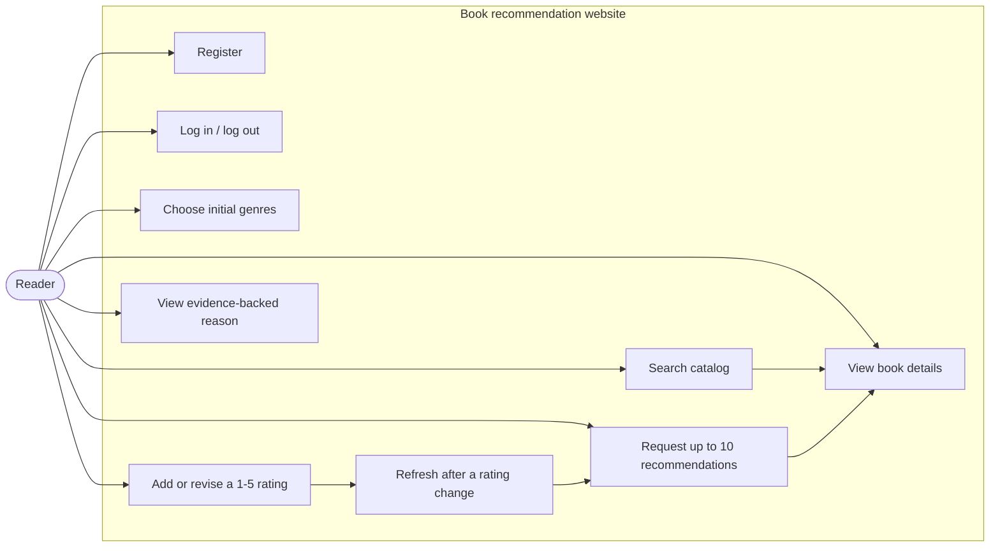
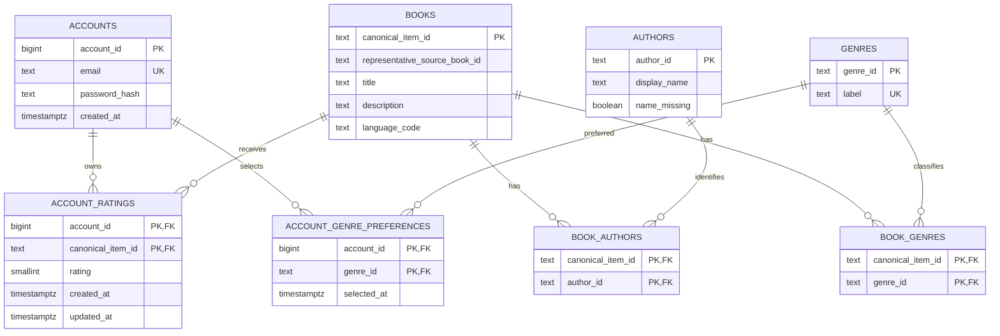
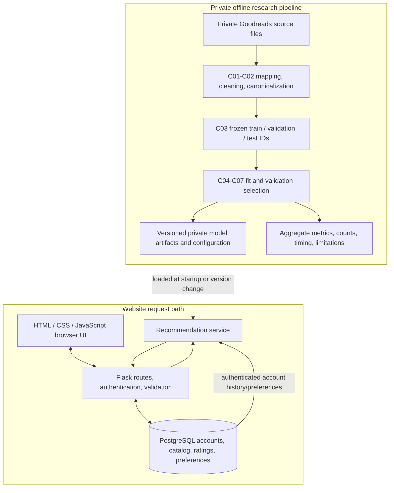

# R02 system design

Date: 21 September 2026

This design implements the signed proposal's website boundary and keeps
website accounts separate from anonymized Goodreads research users. It covers
Use Cases, the relational ERD, the offline/online architecture, and the main
rating-to-recommendation flow.

## Identity boundary

- `research_user_id` exists only in private preparation, splitting, training,
  validation, and test files. It is not a login and is never inserted into the
  website `accounts` table.
- `account_id` is generated by the website database after registration. It
  owns account ratings and initial genre preferences.
- The offline models learn aggregate relationships from research data. The
  online service applies saved model artifacts to the authenticated account's
  own known ratings or selected genres.
- Public demo records must be self-created or publication-permitted. Private
  Goodreads rows and research identifiers are not copied into the demo
  database.

Example: research user `100392` may contribute to a fitted offline model. A
website account such as `account_id=17` is a different identity and owns only
the ratings created through that account's authenticated session.

## Use Cases



Use Case rules:

1. Registration stores a password hash, never a plaintext password.
2. Rating writes require an authenticated session. The server obtains
   `account_id` from that session and ignores any client-supplied owner ID.
3. Re-rating updates the account's existing account-work row.
4. Recommendations exclude every canonical work already rated by that
   account. Canonical work IDs prevent another edition from returning.
5. The response contains ten unique works when at least ten eligible works
   exist; otherwise it states the actual shorter count.
6. No history or unusable model evidence activates a declared popularity
   fallback rather than silently dropping the account.

## Relational ERD



Required database constraints:

| Table | Constraint |
| --- | --- |
| `accounts` | Primary key on `account_id`; normalized email unique and non-null; password hash non-null |
| `account_ratings` | Composite primary key/unique constraint on (`account_id`, `canonical_item_id`); `CHECK (rating BETWEEN 1 AND 5)`; both foreign keys enforced |
| `account_genre_preferences` | Composite primary key on (`account_id`, `genre_id`) |
| Link tables | Composite primary keys prevent duplicate author/genre links |
| `books` | One row per canonical work or documented fallback canonical key, not one row per edition |

An `INSERT ... ON CONFLICT (account_id, canonical_item_id) DO UPDATE` implements
the one-current-rating rule. Ownership checks always use the authenticated
session's `account_id` in the server-side query.

## System architecture



Data preparation and model fitting run outside web requests. Flask loads a
frozen artifact version and calculates the target account's current profile or
scores. A rating edit does not retrain the whole research model.

## Rating update and refresh sequence

```mermaid
sequenceDiagram
    actor Reader
    participant Browser
    participant Flask
    participant DB as PostgreSQL
    participant Rec as Recommendation service

    Reader->>Browser: Submit rating 1-5
    Browser->>Flask: POST rating (canonical_item_id, rating)
    Flask->>Flask: Require login; obtain account_id from session
    Flask->>Flask: Validate work and integer rating range
    Flask->>DB: Upsert (account_id, canonical_item_id, rating)
    DB-->>Flask: Saved current rating
    Flask->>Rec: Invalidate account profile/result cache
    Reader->>Browser: Request recommendations
    Browser->>Flask: GET recommendations
    Flask->>DB: Read current account ratings/preferences
    Flask->>Rec: Score eligible canonical works
    Rec-->>Flask: Up to 10 unique works plus evidence
    Flask-->>Browser: Render refreshed list and reasons
```

## Recommendation boundaries

- Shared offline candidate rules are based on training data only.
- Popularity uses explicit training-rating counts, not Goodreads global
  metadata totals.
- Missing CF/content evidence is an unavailable component, not numeric zero.
- An available content cosine of zero remains a valid score.
- Stable canonical item ID breaks equal scores.
- Explanations may cite actual matched genres, a known positively rated work,
  actual neighbour support, or training popularity only when the supporting
  evidence was retained.

## R02 acceptance mapping

| Check | Evidence in this document |
| --- | --- |
| Use Cases cover required user flow | Use Case diagram and rules |
| ERD covers accounts, books, authors, genres, ratings and preferences | Relational ERD and constraint table |
| Research and website identities remain separate | Identity boundary |
| Offline fitting does not run inside requests | Architecture diagram |
| Re-rating updates one owned row and refreshes the profile | Sequence diagram |
| Canonical works support edition exclusion | `books` and `account_ratings` design |
